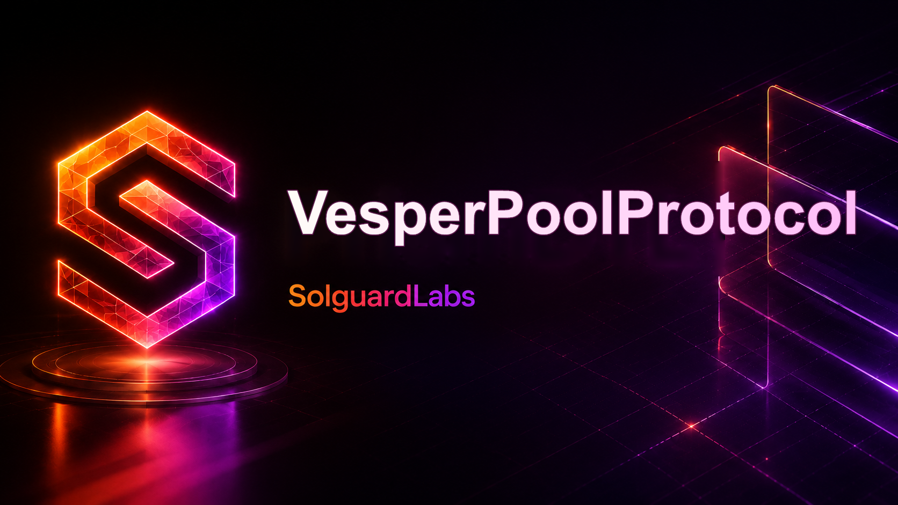

# Vesper Pool Protocol



Vesper Pool Protocol es una implementación en Vyper de un AMM para pares de baja volatilidad.
El pool mantiene dos activos correlacionados, LP shares ERC-20 internas, swaps con fee,
retiros balanceados y retiros por cesta objetivo.

El repositorio está preparado como objetivo de revisión profesional: contratos modulares,
periphery operativo, vistas de monitorización, oracle de peg local y tests Python contra despliegues
reales con titanoboa.

## Arquitectura

```text
                         +------------------+
                         | VesperPegOracle  |
                         +---------+--------+
                                   |
+----------------+       +---------v---------+       +------------------+
| VesperRouter   |------>| VesperPool        |<------| VesperPoolLens   |
+----------------+       +---------+---------+       +------------------+
                                  |
        +-------------------------+--------------------------+
        |                         |                          |
        v                         v                          v
VesperRiskPolicy        VesperParameterStore       VesperAccountingLedger
```

- `VesperPool` ejecuta swaps, emisión de LP shares, retiro balanceado, retiro por cesta,
  accounting de fees y sincronización de reservas.
- `VesperRouter` ofrece flujos de usuario con deadlines y lista de pools confiables.
- `VesperPoolLens` y `VesperPoolMonitor` agregan vistas para frontends, keepers y auditoría.
- `VesperPegOracle` mantiene precios 1e18 y estado de frescura de activos correlacionados.
- `VesperPoolRegistry`, `VesperParameterStore` y `VesperAccountingLedger` cubren registro,
  gobierno operativo y snapshots contables.
- `VesperMockERC20` se usa solamente para fixtures y despliegues locales.

## Requisitos

- Python 3.11 o superior.
- Vyper `0.4.3`.
- titanoboa `0.2.8` o superior.

## Inicio Rápido

```bash
python -m venv .venv
source .venv/bin/activate
python -m pip install -r requirements.txt
python scripts/check_contracts.py
python -m pytest -q
```

En Windows PowerShell:

```powershell
python -m venv .venv
.\.venv\Scripts\Activate.ps1
python -m pip install -r requirements.txt
python scripts/check_contracts.py
python -m pytest -q
```

## Comandos

```bash
bash scripts/tests.sh
bash scripts/ci.sh
```

```powershell
.\scripts\tests.ps1
.\scripts\ci.ps1
```

## Flujo Operativo

1. Los LPs aprueban ambos tokens y llaman a `addLiquidity`.
2. El pool emite LP shares internas contra el invariant actual.
3. Los usuarios intercambian uno de los activos con `swap`.
4. La fee de swap queda en reservas; la parte de protocolo se separa en accounting.
5. Los LPs pueden retirar proporcionalmente con `removeLiquidity`.
6. Los LPs pueden solicitar una cesta específica con `removeLiquidityImbalanced`.
7. Los operadores reclaman fees de protocolo mediante `claimProtocolFees`.
8. Keepers y frontends leen estado mediante lens, monitor y ledger.

## Tests

La suite cubre:

- Swaps y quoting.
- Emisión de LP shares.
- Retiros balanceados.
- Retiros por cesta objetivo.
- Accounting y claim de fees de protocolo.
- Flujos por router.
- Vistas de lens y oracle.

Ejecutar:

```bash
python -m pytest -q
```

## Estructura

```text
src/
  accounting/
  core/
  governance/
  interfaces/
  monitoring/
  oracle/
  periphery/
  policy/
  tokens/
tests/
  integration/
  unit/
scripts/
```

## Estado

Este repositorio es un entorno autocontenido de revision de protocolo. No depende de servicios
externos ni de RPC publico para compilar o ejecutar tests.

## Licencia

MIT.
